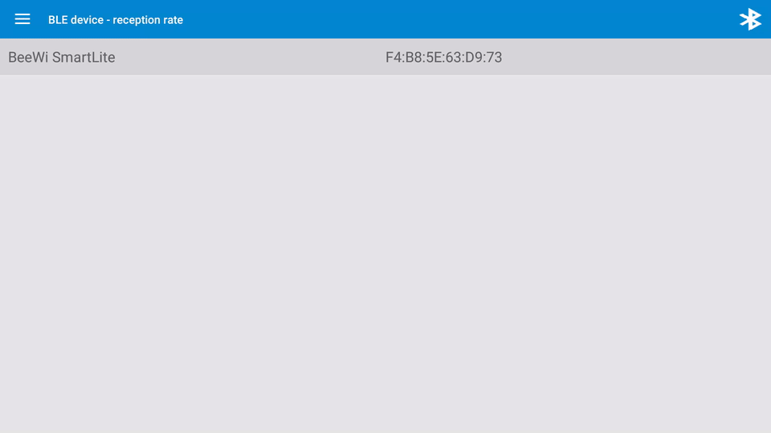

# RFdroid-scanparam

[](https://travis-ci.org/akinaru/rfdroid-ble-scanparam)
[](LICENSE.md)

Modification of <a href="https://github.com/akinaru/RFdroid">RFdroid application</a> to be used with a patched version of AOSP plaform/base & apps/Bluetooth.
The patch include addition of the following API : 

in `BluetoothAdapter.java` : 
```
public boolean startLeScan(final UUID[] serviceUuids, int scanIntervalMillis, int scanWindow, 
							final LeScanCallback callback) 
```

It can start a BLE scan with a specified scan interval and scan window

Patches can be found <a href="https://github.com/akinaru/rfdroid-ble-scanparam/blob/master/patch">here</a>



## Build

### Get code source

```
git clone git@github.com:akinaru/rfdroid-ble-scanparam.git
cd rfdroid-ble-scanparam
```

### Build Android App

```
./gradlew clean build
```

## External projects

* BLE AD frame parser : https://github.com/TakahikoKawasaki/nv-bluetooth

* DiscreteSeekbar : https://github.com/AnderWeb/discreteSeekBar

* MPAndroidChart : https://github.com/PhilJay/MPAndroidChart

## License

```
Copyright (C) 2016  Bertrand Martel

This program is free software; you can redistribute it and/or
modify it under the terms of the GNU General Public License
as published by the Free Software Foundation; either version 3
of the License, or (at your option) any later version.

Foobar is distributed in the hope that it will be useful,
but WITHOUT ANY WARRANTY; without even the implied warranty of
MERCHANTABILITY or FITNESS FOR A PARTICULAR PURPOSE.  See the
GNU General Public License for more details.

You should have received a copy of the GNU General Public License
along with Foobar.  If not, see <http://www.gnu.org/licenses/>.
```
